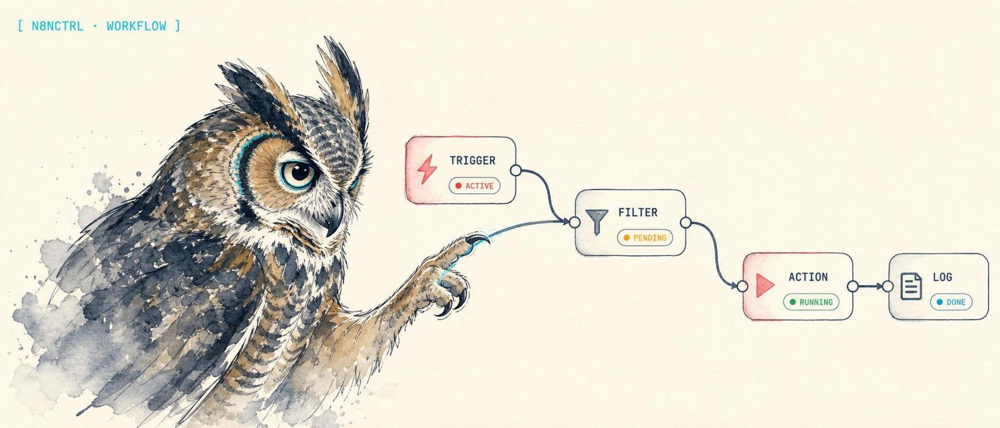

<p align="center">
  
</p>

<h1 align="center">n8nctrl</h1>

<p align="center">
  <strong>Operator control CLI for n8n, with an MCP adapter for AI clients.</strong>
</p>

<p align="center">
  <a href="https://lidless.dev/n8n-ops-mcp"><strong>Website &amp; docs &rarr; lidless.dev/n8n-ops-mcp</strong></a>
</p>

<p align="center">
  
  
  
  
</p>

**n8nctrl is an operator control CLI for [n8n](https://n8n.io) workflow automation.** It lists, inspects, validates, audits, and reports on your n8n workflows and executions over the n8n Public API, so you can ask "what broke in my n8n today?" and act on the answer from a terminal, cron, CI, or an agent. Unlike catalog/docs tools that index n8n's node library for building flows, n8nctrl is built for operating the flows you already run: triage failed executions, find drift, scan for security risks, and inspect live schedules, webhooks, credentials metadata, and tags.

The MCP surface is the adapter layer: run `n8nctrl mcp` for stdio MCP, or keep using the back-compat `n8n-ops-mcp` binary in existing launchers. The same package also ships a first-class [OpenClaw](https://github.com/openclaw/openclaw) plugin. It works with Claude Desktop, Claude Code, Codex CLI, Cursor, Windsurf, or any other MCP host, with no hard dependency on a specific model or agent harness.

## What it does

n8nctrl connects operators and agents to a running n8n instance for **workflow automation ops**: it surfaces your n8n workflows, executions, schedules, webhooks, tags, and credentials over the n8n Public API. From the CLI, you get scriptable read/report commands for shells, cron, and CI. Through `n8nctrl mcp` or the compatibility `n8n-ops-mcp` bin, your agent gets native awareness of your n8n footprint, so it can answer "what's broken in my n8n?", trigger a workflow from chat, audit for security risks, or clean up old executions without leaving your client.

Read tools are always available. Write tools (create, save, archive, delete, trigger, retry, tag CRUD, pin data) are hidden unless `N8N_ENABLE_EDIT=true`, and credential writes sit behind a second gate. Destructive operations are confirm-gated and snapshot to a backup directory first. See the [Security model](#security-model).

## Install

```bash
npm install -g n8n-ops-mcp
```

The npm package name remains `n8n-ops-mcp` for compatibility. After a global install, use the standard CLI as `n8nctrl`. Existing `n8n-ops` and `n8n-ops-mcp` launchers remain supported as compatibility aliases.

For MCP launchers, you can still run it on demand via `npx -y n8n-ops-mcp` (no global install needed), which is what the MCP client config below does.

## Try it: MCP client config

Drop this into your MCP client config (Claude Desktop shown). The binary runs straight from npm via `npx`, so there is nothing to install first:

```json
{
  "mcpServers": {
    "n8n": {
      "command": "npx",
      "args": ["-y", "n8n-ops-mcp"],
      "env": {
        "N8N_BASE_URL": "https://n8n.example.com",
        "N8N_API_KEY": "your-n8n-api-key"
      }
    }
  }
}
```

Generate the API key in n8n under **Settings &rarr; API**. Point `N8N_BASE_URL` at your n8n instance. That is the whole read-only setup. To unlock write tools, add `"N8N_ENABLE_EDIT": "true"` to `env`.

Then ask your agent:

> What n8n workflows broke today?

It calls `n8n_list_executions` with `status=error`, then `n8n_get_execution` on the failing run for the per-node log and raw error.

## Tools

40 tools across read-only ops, the workflow + execution lifecycle, tags, and credentials. Write tools (marked) are hidden unless `N8N_ENABLE_EDIT=true`; credential writes (marked ✓✓) need a second gate.

| Tool | Purpose | Write |
|---|---|---|
| `n8n_list_workflows` | List workflows, filter by `active` / `tags` / `name` | |
| `n8n_get_workflow` | Fetch one workflow, optionally with full node graph | |
| `n8n_list_executions` | List recent executions, filter by workflow / status | |
| `n8n_get_execution` | Fetch an execution with per-node run log + raw error | |
| `n8n_search_executions` | Text-search recent executions for an error fragment | |
| `n8n_list_webhooks` | Enumerate webhook + form-trigger URLs | |
| `n8n_validate_workflow` | Static checks: deprecated nodes, legacy Code-node API, orphans | |
| `n8n_diff_workflow` | Compare a workflow against a snapshot file or inline object - semantic diff (added/removed/modified nodes with field paths) | |
| `n8n_list_schedules` | List every schedule trigger across workflows with human-readable descriptions ("daily at 03:00", "cron: 0 */6 * * *") | |
| `n8n_audit_browser_bridge_usage` | Find every workflow that calls the [`browser-bridge`](https://github.com/lidless-labs/browser-bridge) CLI (Execute Command, Code, SSH nodes) | |
| `n8n_scaffold_browser_bridge_node` | Generate a ready-to-paste n8n node that calls a `browser-bridge <platform> <action>` (no API call) | |
| `n8n_run_audit` | Run n8n's built-in security audit (credentials, database, nodes, filesystem, instance) | |
| `n8n_find_workflows_using_node_type` | Find every workflow using a given node type (e.g. `n8n-nodes-base.slack`), with `exact` or `contains` match | |
| `n8n_execution_stats` | Per-workflow stats over a recent window: counts, failure rate, avg + p95 runtime, last failure | |
| `n8n_list_tags` | List workflow tags with `id`, `name`, `createdAt`, `updatedAt` | |
| `n8n_get_workflow_tags` | Read the tags currently attached to a workflow | |
| `n8n_list_credentials` | List credentials (metadata only - secrets never echoed; admin/owner key required) | |
| `n8n_get_credential_schema` | Fetch the JSON schema for a credential type (e.g. `freshdeskApi`) | |
| `n8n_find_workflows_using_credential` | Find every workflow node that references a credential by `id` (preferred) or `name` substring; rotation/blast-radius scanner | |
| `n8n_check_disabled_nodes` | Scan workflows for `disabled: true` nodes - common drift signals not surfaced in the n8n UI | |
| `n8n_trigger` | Run a workflow via webhook (reliable) or workflow-id (confirm-gated; executes arbitrary workflow nodes) | ✓ |
| `n8n_create_workflow` | Create a workflow (confirm-gated for writes; dry-run preview without confirm; accepts `n8n_get_workflow` output directly; optional project/folder target) | ✓ |
| `n8n_activate` | Enable a workflow's triggers (confirm-gated; arms arbitrary-code execution) | ✓ |
| `n8n_deactivate` | Disable a workflow's triggers (confirm-gated) | ✓ |
| `n8n_save_workflow` | Overwrite a workflow with auto-backup + validation + confirm gate | ✓ |
| `n8n_archive_workflow` | Soft-delete a workflow (confirm-gated; reversible; preserves id) | ✓ |
| `n8n_unarchive_workflow` | Restore an archived workflow (does NOT reactivate) | ✓ |
| `n8n_delete_workflow` | Permanently delete a workflow (confirm-gated, snapshot-before-delete, restore via `n8n_create_workflow`) | ✓ |
| `n8n_cancel_execution` | Stop a running or waiting execution by id | ✓ |
| `n8n_retry_execution` | Retry a failed execution by id (returns a new execution) | ✓ |
| `n8n_delete_execution` | Permanently delete an execution record (confirm-gated, irreversible) | ✓ |
| `n8n_delete_executions` | Batch form of delete (client-side fan-out, confirm-gated, irreversible, max 50 ids) | ✓ |
| `n8n_pin_node_data` | Pin sample data to a node so downstream nodes use it during testing (confirm-gated, replace-or-merge) | ✓ |
| `n8n_unpin_node_data` | Clear pinned data on one node or the whole workflow (confirm-gated, idempotent) | ✓ |
| `n8n_create_tag` | Create a workflow tag (confirm-gated; reversible via `n8n_delete_tag`) | ✓ |
| `n8n_delete_tag` | Permanently delete a tag (confirm-gated; cascades - removes the tag from every workflow) | ✓ |
| `n8n_set_workflow_tags` | Replace the tag set on a workflow (confirm-gated; reversible by re-setting) | ✓ |
| `n8n_retry_executions` | Batch retry executions (confirm-gated, max 50 ids, AbortController on 5xx) | ✓ |
| `n8n_create_credential` | Create a credential (confirm-gated; **double-gated** behind `enableCredentialsWrite`; tool layer redacts `data` from every response branch) | ✓✓ |
| `n8n_delete_credential` | Permanently delete a credential (confirm-gated; **double-gated**; cascades - every workflow referencing it will fail) | ✓✓ |

Write tools are hidden unless `N8N_ENABLE_EDIT=true`.

<details>
<summary><b>Detailed tool reference</b></summary>

**`n8n_list_workflows`** - filter by `active`, `tags`, `name` (substring), `limit`. Returns id, name, active state, tags, updatedAt.

**`n8n_get_workflow`** - fetch one by id. Returns metadata by default. Pass `includeDefinition: true` for the full node graph + connections.

**`n8n_list_executions`** - filter by `workflowId`, `status` (success/error/running/waiting/canceled), `limit`. Returns id, workflowId, workflowName, status, mode, startedAt, stoppedAt.

**`n8n_get_execution`** - includes per-node run log (truncated to `maxExecutionLogBytes`, default 64 KB) and the raw error object verbatim when status is `error`. Pass `includeRunData: false` to skip the run log.

**`n8n_search_executions`** - defaults to scanning `status=error` executions for a `query` fragment (e.g. `ECONNREFUSED`) and returning matches with workflow context + a snippet around each hit. `scope: "error"` (default) greps the error payload only; `scope: "all"` also greps full per-node run data (slower, may return node outputs - treat snippets as sensitive). Optional `workflowId`, `status`, `limit` (default 50, max 250), `maxMatches` (default 20), `snippetChars` (default 160). Returns `matches` plus a `skipped` array for any execution that failed to fetch.

**`n8n_list_webhooks`** - scans workflows for webhook and form-trigger nodes and returns their paths + fully-formed `triggerUrl`. Pairs with `n8n_trigger` mode='webhook'. Optional `workflowId`, `activeOnly` (default true), `limit` (default 50).

**`n8n_validate_workflow`** - checks for deprecated node types (function → code), legacy Code-node API (`$node[]`, `items` global, `require()`), orphan nodes, disabled nodes, missing trigger. Returns issues with severity (error/warning/info) plus a summary count.

**`n8n_list_schedules`** - scans `n8n-nodes-base.scheduleTrigger` and the legacy `n8n-nodes-base.cron` nodes across workflows and decodes each interval rule into a human-readable string. Answers "what's running at 3am?" without clicking through the n8n UI. Supported rule fields: `seconds` / `minutes` / `hours` / `days` / `weeks` / `months` (with `triggerAtHour`, `triggerAtMinute`, `triggerAtDay`, `triggerAtDayOfMonth`) and raw `cronExpression`. One entry per interval - multi-interval rules emit multiple rows. Each row includes `workflowId`, `workflowName`, `active`, `nodeName`, `nodeType`, `schedule`, `field`, optional `cronExpression`, and the original `raw` rule for further inspection. Optional `workflowId` (single-workflow scan), `activeOnly` (default true - inactive schedules don't fire), `limit` (default 100, max 250).

**`n8n_diff_workflow`** - compare a workflow's current state against a snapshot. Pass `id` plus exactly one of `snapshotPath` or `snapshot` (inline object). `snapshotPath` is **confined to the configured `backupDir`** (default `~/.n8n-backups`): it may be given relative to that directory or as an absolute path inside it, but any path that resolves outside `backupDir` (including `..` traversal) is rejected before the file is read. This keeps the tool from being used as an arbitrary file-read primitive even though it is available without `enableEdit`. Snapshot accepts both shapes: the flat backup written by `n8n_save_workflow` / `n8n_delete_workflow`, and the nested `n8n_get_workflow(includeDefinition=true)` shape (graph data under `definition`). Returns `summary` (counts: added/removed/modified/nameChanged/connectionsChanged/settingsChanged) plus `diff` with per-node `fieldsChanged` paths (e.g. `parameters.command`, `parameters.url`, `disabled`). Node matching is two-pass: id first, then name fallback for any unmatched nodes - handles legacy/hand-edited snapshots. Cosmetic changes (`position`, `webhookId`) are suppressed by default; pass `ignoreCosmetic: false` to surface them. Per-node detail is capped at `maxModifiedDetails` (default 50, max 500); `summary.nodesModified` counter is uncapped and `diff.nodesModifiedTruncated: true` flags when detail was clipped. Read-only.

**`n8n_audit_browser_bridge_usage`** - scans every workflow for nodes that invoke the `browser-bridge` CLI. Inspects `command` (Execute Command + SSH nodes) and `jsCode` / `pythonCode` / `functionCode` (Code + legacy Function nodes). Heuristic: `\bbrowser-bridge\.[cm]?js` followed by two kebab-slug args; the bare bin form is intentionally not detected to avoid false positives from path mentions like `cd /opt/browser-bridge`. Returns one finding per `(workflowId, nodeName, platform, action)` plus a `summary` of platform×action counts. Optional `platform`, `action`, `activeOnly` (default false), `includeArchived` (default false), `maxWorkflows` (default 250, max 1000), `concurrency` (default 3, max 8). Read-only. Pairs with `n8n_scaffold_browser_bridge_node` when you need to add another call. Companion repo: [browser-bridge](https://github.com/lidless-labs/browser-bridge).

**`n8n_scaffold_browser_bridge_node`** - pure local generator (no n8n API call). Given `platform`, `action`, optional `input` JSON, and `mode: "code-node" | "execute-command"` (default `code-node`), emits a ready-to-paste n8n node JSON that mirrors `browser-bridge`'s `docs/n8n-usage.md` patterns. The Code node uses `spawnSync` with stdin JSON and surfaces `payload.exitCode` + `stderr` so downstream nodes can branch on `ok`. The Execute Command node uses a quoted `<<'JSON'` heredoc so the input passes through unmangled. Optional `bridgeDir`, `nodeName`, `position`. Platform/action are validated as kebab slugs - keeps them safe to interpolate into the shell command. Warns when `execute-command` is used with non-empty `input` (heredoc bakes the JSON in; no per-item upstream wiring).

**`n8n_trigger`** - **write tool** (hidden unless `enableEdit`); requires `confirm: true`. Triggering runs the workflow's nodes (Code / Execute Command / HTTP, etc.) and POSTs to webhooks, all of which can have arbitrary real-world side effects, so it lives behind the same edit gate as the other write tools and refuses without `confirm: true`. `webhookPath` is validated client-side: it must resolve to a path under `/webhook`, `/webhook-test`, or `/form`, with no `..` traversal or scheme-relative `//host` form, so a confused agent cannot redirect the call off the base URL. Two modes:
- `mode: "webhook"` + `webhookPath` - POST (or GET/PUT/DELETE) to the configured base URL + path, with an optional JSON `payload`. This is the reliable path.
- `mode: "workflow"` + `workflowId` - attempts `POST /api/v1/workflows/:id/execute`. Pre-checks that the workflow is active and has a webhook/manual/form trigger. Most n8n builds don't expose this endpoint on the Public API and will 405; the tool surfaces a hint to switch to webhook mode.

**`n8n_create_workflow`** - `POST /workflows`. Creates from structured workflow JSON: `name`, `nodes`, `connections`, optional `settings` / `staticData`. Also accepts the full output of `n8n_get_workflow` (with `includeDefinition=true`) and backup snapshots directly. Strips read-only fields (`id`, `active`, `createdAt`, `updatedAt`, `isArchived`, `versionId`, `triggerCount`, `tags`, `shared`, `meta`, `pinData`) before POSTing - n8n enforces `additionalProperties: false` on the workflow schema and will 400 on any readOnly field. Runs `n8n_validate_workflow` on the proposed state as a pre-check; errors block, warnings pass through (pass `skipValidation: true` to bypass). Optional `dryRun:true` returns the cleaned POST body and validation issues without writing (no `confirm` needed for a dry run). Optional `projectId` and `folderId` are sent as create-target query params. Requires `confirm: true` to actually write - the tool accepts an arbitrary `nodes` graph that will live on the server, so an unconfirmed call (without `dryRun`) returns `ok: false` and never touches the API. The new workflow is created INACTIVE; call `n8n_activate` afterwards if you want triggers running. This is also the primary restore path for `n8n_delete_workflow` snapshots: read the backup file into `definition` and call this tool. The restored workflow gets a new id.

**`n8n_activate`** / **`n8n_deactivate`** - idempotent; both require `confirm: true`. Activating arms the workflow's triggers, so its nodes can start running automatically (effectively arming arbitrary-code execution); deactivating halts that automation. Deactivating does not cancel running executions.

**`n8n_save_workflow`** - before writing: fetches the current version, snapshots it to `backupDir` as `<id>-<timestamp>.json` (mode 0600), runs `validateWorkflow` on the proposed state, and aborts on error-severity issues (pass `skipValidation: true` to bypass). Requires `confirm: true` to actually PUT; calling with `confirm: false` returns `ok: false` and never touches the API (omitting `confirm` is rejected at the MCP schema layer). Response includes the backup path and a `restoreHint`.

**`n8n_archive_workflow`** - `POST /workflows/{id}/archive`. Soft-deletes a workflow: triggers stop firing, the workflow disappears from the default UI list, but the definition and execution history are preserved. Idempotent (archiving an already-archived workflow returns the current state). Requires `confirm: true` (it deactivates and soft-deletes the workflow); reversible via `n8n_unarchive_workflow`. Archiving deactivates as a side effect; the response surfaces `active: false` explicitly. Returns `ok: false` with `reason: "not_found"` on 404.

**`n8n_unarchive_workflow`** - `POST /workflows/{id}/unarchive`. Restores an archived workflow. Does NOT reactivate - triggers stay off until you call `n8n_activate` explicitly. Returns `ok: false` with `reason: "not_found"` on 404.

**`n8n_delete_workflow`** - `DELETE /workflows/{id}`. Permanent, irreversible. Before firing the DELETE: fetches the current workflow and snapshots it to `backupDir` as `<id>-DELETED-<timestamp>.json` (mode 0600). If the snapshot can't be written, the DELETE is aborted - there is no un-safety-netted path. Requires `confirm: true`; omitting it or passing `false` returns `ok: false` and never touches the API. Returns `ok: false` with `reason: "not_found"` on 404 (either before or after the snapshot). **Restore is one-call via `n8n_create_workflow`** with the snapshot contents; the restored workflow gets a new id and is created inactive. Deleting does NOT cancel running executions - use `n8n_list_executions(workflowId, status='running')` + `n8n_cancel_execution` first if needed. **Prefer `n8n_archive_workflow` for cleanup** if you want to preserve the original id.

**`n8n_cancel_execution`** - `POST /executions/{id}/stop`. Closes the triage loop after `n8n_search_executions` locates a stuck run. Returns a success summary with the execution's final status, or `ok: false` with `reason: "not_found_or_finished"` if the id no longer matches a running execution (404).

**`n8n_retry_execution`** - `POST /executions/{id}/retry`. Creates a NEW execution - the response surfaces both `originalExecutionId` and `newExecutionId` so agents can follow up with `n8n_get_execution` on the retry. Optional `loadWorkflow: true` retries against the currently saved workflow instead of the version captured at original execution time. Returns `ok: false` with `reason: "not_found"` on 404 or `reason: "not_retryable"` on 409 (e.g. still running); all other API errors rethrow.

**`n8n_delete_execution`** - `DELETE /executions/{id}`. Permanently removes an execution record: logs, per-node run data, and error payloads are erased from n8n. Requires `confirm: true` to actually delete; calling with `confirm: false` returns `ok: false` and never touches the API (omitting `confirm` is rejected at the MCP schema layer). Returns `ok: false` with `reason: "not_found"` on 404; all other API errors rethrow. Not idempotent from an agent's perspective: the record is gone after the first successful call, so fetch `n8n_get_execution` first if you may need it later.

**`n8n_pin_node_data`** - pin sample data to a node so downstream nodes use it during testing/development without re-running the upstream node. Pairs naturally with `n8n_scaffold_browser_bridge_node`: scaffold a browser-bridge call, run it once, capture the output, pin it, then iterate on downstream nodes without re-spawning the browser. Inputs: `id`, `nodeName` (case-sensitive, must match an existing node), `data` (1-50 items; raw objects are auto-wrapped into `{json: <object>}`, items already shaped as `{json: ..., binary?: ...}` pass through unchanged), optional `merge: true` to append to existing pinned data instead of replacing (combined still capped at 50), `confirm: true`. Issues PUT `/workflows/{id}` with merged `pinData` plus the existing nodes/connections/settings/staticData (so the PUT does not blank them). Pinned data persists across executions until cleared - easy to forget; the response includes an `unpinHint`.

**`n8n_unpin_node_data`** - clear pinned data on one node (when `nodeName` is supplied) or the whole workflow (when omitted). Idempotent: clearing a node that wasn't pinned returns `ok: true` with `noop: true` and never touches the API. When clearing actually happens, the PUT includes the rest of the workflow body so other fields are not blanked. Requires `confirm: true`.

**`n8n_delete_executions`** - batch form. Client-side fan-out over `DELETE /executions/{id}` with bounded concurrency (default 3, max 10). Takes an `ids` array (deduped before fan-out, capped at 50), requires `confirm: true`. Response surfaces `requested`/`attempted`/`deleted`/`alreadyDeleted`/`failed`/`skipped`/`aborted` counters plus a `results: Array<{id, ok, reason?, message?}>` - order is completion order, not input order, so look up by id. 404 per id is treated as `already_deleted` (idempotent). A 5xx on any id aborts the batch via an `AbortController`: no new ids are claimed and any already-in-flight `fetch`es are cancelled client-side. Under concurrency N, up to N-1 deletes may have already reached the server before the 5xx is observed, so the batch is best-effort, not transactional - clear signal the server is sick; don't retry blindly. Per-id error messages are passed through the API-key redactor. Compose with `n8n_search_executions` to purge a known set of noisy runs in one call.

**`n8n_retry_executions`** - batch form of retry. Same fan-out shape as `n8n_delete_executions`: bounded concurrency (default 3, max 10), capped at 50 ids, `AbortController` on 5xx, results in completion order. **Differs in two ways:** 404 per id is `{ ok: false, reason: "not_found" }` (NOT idempotent - a missing execution is a real failure to surface), and each successful retry creates a NEW execution whose id is returned per row as `newExecutionId`. Counters: `requested`/`attempted`/`retried`/`notFound`/`failed`/`skipped`/`aborted`. Optional `loadWorkflow: true` retries every id against the currently saved workflow instead of the captured version. Confirm-gated - each retry runs the workflow again and may re-trigger side effects (HTTP calls, DB writes); verify the workflow is safe to re-run before confirming.

**`n8n_run_audit`** - `POST /audit`. Runs n8n's built-in security audit and returns one risk report per requested category: **credentials** (unused/abandoned), **database** (SQL-injection-prone expressions in query nodes), **nodes** (community/unofficial nodes), **filesystem** (host fs access from nodes), **instance** (insecure server settings). Each report has `risk`, `sections` (with `title`/`description`/`recommendation`/`location`). The tool also surfaces a flat `reports` array with per-report `sectionCount`/`locationCount` so an agent can decide what to drill into without reparsing the whole audit. Optional `categories` (omit for all five) and `daysAbandonedWorkflow` (n8n default 90). Read-only - n8n only inspects, never mutates. **Requires the API user to be an instance admin or owner** (n8n's audit endpoint enforces this).

**`n8n_find_workflows_using_node_type`** - composed read-only scanner. Walks every workflow (paginated, capped at `maxWorkflows`, default 250 / max 1000) and emits one finding per node matching the requested type. `match: "exact"` (default) is full-string equality on `node.type`; `match: "contains"` is case-insensitive substring (handy for "all Slack nodes across base + community packages"). Optional `activeOnly` (default false), `includeArchived` (default false), `includeDisabledNodes` (default true - disabled nodes are common drift signals worth surfacing), `concurrency` (default 3, max 8). Returns per-node `findings` plus a per-workflow `summary` sorted by match count descending. Per-workflow fetch errors land in `fetchErrors` instead of failing the whole scan. Pairs with `n8n_audit_browser_bridge_usage` (which schedules drive my browser-bridge calls?) and `n8n_run_audit` (which deprecated nodes need replacing?).

**`n8n_execution_stats`** - composed read-only aggregator over `n8n_list_executions`. Per-workflow counts (total/success/error/canceled/running/waiting/other), failure rate (`error / (success + error + canceled)`), avg + p95 runtime over completed executions, and `lastFailureAt` / `lastSuccessAt`. Optional `workflowId` (single-workflow stats), `sinceHours` (default 24, max 168 = 7d), `maxExecutions` (default 1000, max 5000), `pageSize` (default 250). Pagination stops on the first execution older than the window OR at `maxExecutions`; `stoppedReason` is one of `"window"`, `"cap"`, `"exhausted"`. If `truncated: true`, increase `maxExecutions` or narrow `sinceHours`. The `totals` object includes the same counts + `failureRate` rolled across all workflows in the window. Useful for "which workflows are flaky?" and "what's running long?"

**`n8n_list_tags`** - `GET /tags`. Returns `{ data: [{id, name, createdAt, updatedAt}], nextCursor }`. Optional `limit` (default 100, max 250) and `cursor` (from a previous call's `nextCursor`). Read-only.

**`n8n_get_workflow_tags`** - `GET /workflows/{id}/tags`. Returns the array of tag objects currently attached. Pairs with `n8n_set_workflow_tags` for diffs and reattach flows.

**`n8n_create_tag`** - `POST /tags`. Requires `confirm: true` (consistent with the other mutating tag tools); reversible via `n8n_delete_tag`. The name is trimmed before send. Returns `ok: false` with `reason: "conflict"` on 409 (tag with this name already exists); use `n8n_list_tags` to find the existing id.

**`n8n_delete_tag`** - `DELETE /tags/{id}`. Confirm-gated. **Cascades**: n8n removes the tag from every workflow it was attached to. The workflows themselves are NOT deleted, only the tag association. Returns `ok: false` with `reason: "not_found"` on 404. To find affected workflows beforehand, use `n8n_list_workflows(tags=<name>)` or scan `n8n_get_workflow_tags`.

**`n8n_set_workflow_tags`** - `PUT /workflows/{id}/tags`. **REPLACES** the workflow's tag set (not append) - pass the full desired list. Empty `tagIds: []` clears all tags. Tag ids are deduped before send. Requires `confirm: true` (reversible by re-setting). Returns `ok: false` with `reason: "not_found"` on 404 (the workflow id OR one of the tag ids does not exist; verify both with `n8n_list_workflows` and `n8n_list_tags`).

**`n8n_list_credentials`** - `GET /credentials`. Returns metadata only - n8n's API explicitly excludes the `data` field (encrypted secrets) from list responses, and the tool layer strips `data` defensively in case of a future regression. Each row: `{id, name, type, createdAt, updatedAt, shared[]}`. Optional `limit` (default 100, max 250) and `cursor`. Requires the API key to belong to an instance owner or admin - non-admin keys get `ok: false, reason: "unauthorized"` with a clear hint.

**`n8n_get_credential_schema`** - `GET /credentials/schema/{credentialTypeName}`. Returns the raw JSON Schema describing the required `data` shape for a credential type (e.g. `freshdeskApi` → `{ apiKey, domain }` required). Use this **before** calling `n8n_create_credential` so you know what fields to populate. 404 returns `reason: "not_found"`; 401 returns `reason: "unauthorized"`.

**`n8n_find_workflows_using_credential`** - composed scanner (no direct n8n endpoint). Walks workflows and inspects every node's `credentials` field. Pass either `credentialId` (exact, preferred) or `credentialName` (case-insensitive substring fallback). Returns one finding per `(workflowId, nodeName, credentialType)` plus a per-workflow summary count. Same fan-out shape as `n8n_audit_browser_bridge_usage` (bounded concurrency, `fetchErrors` for per-workflow failures, `truncated` flag, `maxWorkflows` default 250). The answer to "I'm rotating Slack creds, where do I need to update?" - run this **before** `n8n_delete_credential` to see the blast radius.

**`n8n_check_disabled_nodes`** - composed scanner. Surfaces every node with `disabled: true` across recent workflows. One finding per `(workflowId, nodeName, nodeType)` plus per-workflow disabled count, sorted desc. Disabled nodes are common drift signals (frozen mid-debug, forgotten cleanup) and the n8n UI doesn't list them anywhere obvious. Same fan-out + filter shape as the other scanners.

**`n8n_create_credential`** - `POST /credentials`. **Double-gated**: requires both `enableEdit` AND `enableCredentialsWrite` (default false). Confirm-gated. `data` carries plaintext secrets to n8n; the tool layer **never** echoes `data` back, even on error - n8n 400s with body content are wrapped to a status-only error before surfacing, so secrets cannot leak via validation messages. Pre-call: use `n8n_get_credential_schema` to learn the required `data` shape. Post-call: response includes `id`, `name`, `type`, timestamps; no `data`. NOT idempotent - calling twice with the same name creates two credentials.

**`n8n_delete_credential`** - `DELETE /credentials/{id}`. **Double-gated** + confirm-gated. **Cascades**: every workflow referencing this credential will fail on its next run - call `n8n_find_workflows_using_credential` first to enumerate the blast radius. 404 returns `reason: "not_found"`. The deleted-credential payload echoed by n8n has `data` stripped at the tool layer regardless of upstream behavior.

</details>

## Configuration

Generate an API key in n8n under **Settings → API**, then set these env vars in your MCP client config:

| Variable | Required | Default | Description |
|---|---|---|---|
| `N8N_BASE_URL` | yes | - | n8n base URL, e.g. `https://n8n.example.com` |
| `N8N_API_KEY` | yes | - | n8n Public API key (`X-N8N-API-KEY`) |
| `N8N_ENABLE_EDIT` | no | `false` | Expose write tools |
| `N8N_ENABLE_CREDENTIALS_WRITE` | no | `false` | Second gate (on top of `N8N_ENABLE_EDIT`) for `n8n_create_credential` and `n8n_delete_credential`. See [Security model](#security-model). |
| `N8N_BACKUP_DIR` | no | `~/.n8n-backups` | Where `n8n_save_workflow` writes pre-save snapshots |
| `N8N_MAX_EXECUTION_LOG_BYTES` | no | `65536` | Cap on inline execution log bytes |
| `N8N_REQUEST_TIMEOUT_MS` | no | `15000` | HTTP timeout for n8n API calls |

## CLI

`n8nctrl` is the standard read-only **operator control CLI** for shells, cron, and CI. It talks to the same n8n Public API as the MCP server and shares the same client core, so what the agent can read, you can read from a terminal. It exposes only the read/report tools - no create, save, archive, delete, cancel, retry, or trigger. The older `n8n-ops` bin remains a compatibility alias.

```bash
# installed globally, the standard bin is `n8nctrl`:
n8nctrl workflows list --active
n8nctrl workflows get <id> --full
n8nctrl workflows validate <id>
n8nctrl executions list --status error --since 24
n8nctrl executions search "ECONNREFUSED" --scope all
n8nctrl executions stats --since 48
n8nctrl webhooks list
n8nctrl schedules list
n8nctrl tags list
n8nctrl credentials find-usage <credentialId>
n8nctrl nodes find n8n-nodes-base.slack --contains
n8nctrl nodes check-disabled
n8nctrl audit run            # exit 1 if the backend is unreachable (cron-friendly)
n8nctrl audit browser-bridge
n8nctrl --json tags list     # raw JSON for piping
```

Run `n8nctrl help` for the full command and flag list. Configure with the same `N8N_BASE_URL` / `N8N_API_KEY` env vars as the MCP server (see the table above). Exit codes: `0` success, `1` runtime error (backend unreachable or a call failed), `2` usage error (unknown command/flag or bad value).

### Starting the MCP adapter

`n8nctrl mcp` starts the stdio MCP adapter. The `n8n-ops-mcp` bin remains supported for existing MCP client configs and package launchers. If a launcher referenced the built file path `dist/mcp-server.js` directly, point it at `dist/mcp-bin.js` (or `dist/cli.js mcp`); launchers that use the `n8n-ops-mcp` bin name need no change.

### Claude Desktop

Add to `~/Library/Application Support/Claude/claude_desktop_config.json` (macOS) or `%APPDATA%\Claude\claude_desktop_config.json` (Windows):

```json
{
  "mcpServers": {
    "n8n": {
      "command": "npx",
      "args": ["-y", "n8n-ops-mcp"],
      "env": {
        "N8N_BASE_URL": "https://n8n.example.com",
        "N8N_API_KEY": "your-api-key-here"
      }
    }
  }
}
```

### Claude Code

```bash
claude mcp add n8n \
  --env N8N_BASE_URL=https://n8n.example.com \
  --env N8N_API_KEY=your-api-key-here \
  -- npx -y n8n-ops-mcp
```

Add `--scope user` to make it available from any directory instead of only the current project.

### Codex CLI

```bash
codex mcp add n8n \
  --env N8N_BASE_URL=https://n8n.example.com \
  --env N8N_API_KEY=your-api-key-here \
  -- npx -y n8n-ops-mcp
```

Writes the entry to `~/.codex/config.toml` under `[mcp_servers.n8n]`. Verify with `codex mcp list`.

### Cursor / Windsurf / other MCP hosts

Any MCP-compatible client that accepts a stdio command + env will work. Point it at `npx -y n8n-ops-mcp` (or the globally installed `n8n-ops-mcp` binary) with `N8N_BASE_URL` and `N8N_API_KEY` in the environment.

<details>
<summary><b>Hermes Agent</b></summary>

[Hermes Agent](https://github.com/NousResearch/hermes-agent) reads MCP config from `~/.hermes/config.yaml`:

```yaml
mcp_servers:
  n8n:
    command: "npx"
    args: ["-y", "n8n-ops-mcp"]
    env:
      N8N_BASE_URL: "https://n8n.example.com"
      N8N_API_KEY: "your-api-key-here"
```

Then reload from inside a session:

```
/reload-mcp
```

</details>

### OpenClaw (first-class plugin)

n8nctrl ships as a first-class OpenClaw plugin through the `n8n-ops-mcp` package - not an MCP bridge - so it shares the gateway's process, auth profiles, and hooks.

```bash
openclaw plugins install clawhub:n8n-ops-mcp
```

Add the config block to `~/.openclaw/openclaw.json`:

```json
{
  "plugins": {
    "entries": {
      "n8n": {
        "enabled": true,
        "config": {
          "baseUrl": "https://n8n.example.com",
          "enableEdit": false
        }
      }
    }
  }
}
```

Put the API key in your OpenClaw workspace env:

```bash
# ~/.openclaw/workspace/.env
N8N_API_KEY=your-api-key-here
```

Restart the gateway:

```bash
systemctl --user restart openclaw-gateway
```

Config keys: `baseUrl`, `apiKey`, `apiKeyEnv`, `enableEdit`, `enableCredentialsWrite`, `maxExecutionLogBytes`, `requestTimeoutMs`, `backupDir`. See [`openclaw.plugin.json`](./openclaw.plugin.json) for the full schema and the [Security model](#security-model) for the two-gate write design.

<details>
<summary><b>OpenClaw - manual (non-ClawHub) install</b></summary>

If you want to point OpenClaw at a local clone instead of the registry:

```json
{
  "plugins": {
    "allow": ["n8n"],
    "load": {
      "paths": ["/absolute/path/to/n8n-ops-mcp"]
    },
    "entries": {
      "n8n": {
        "enabled": true,
        "config": {
          "baseUrl": "https://n8n.example.com",
          "enableEdit": false
        }
      }
    }
  }
}
```

</details>

## Security model

Two flags gate write access, with deliberately different blast radii:

- **`enableEdit`** (default `false`) - exposes the workflow + execution lifecycle write tools (create/save/archive/delete workflows, activate/deactivate, **trigger**, cancel/retry/delete executions, pin/unpin node data, tag CRUD). `n8n_trigger` is gated here too: running a workflow executes arbitrary Code / Execute Command / HTTP nodes and POSTs to webhooks, so it is treated as a write. Mutating tools are confirm-gated (including `trigger`, `activate`, `deactivate`, `archive`, `create_workflow`, `create_tag`, and `set_workflow_tags`), and the destructive workflow ones snapshot to `backupDir` first. The read-only `n8n_diff_workflow` confines `snapshotPath` reads to `backupDir` so it cannot be turned into an arbitrary file-read primitive.
- **`enableCredentialsWrite`** (default `false`) - **second gate**, on top of `enableEdit`, required to expose `n8n_create_credential` and `n8n_delete_credential`. An agent that has been overprovisioned with `enableEdit` cannot inject or destroy credentials without this separate, deliberate config change.

Both flags must be true for credential writes to register. The credential **read** tools (`list-credentials`, `get-credential-schema`, `find-workflows-using-credential`) and the disabled-node scanner are always available regardless.

Why credentials get a second gate:
1. `create-credential` is the only tool in this package where agent input contains plaintext secrets. A prompt-injected or confused agent with `enableEdit` shouldn't be able to inject credentials.
2. `delete-credential` cascades - every workflow referencing the credential fails on its next run. The blast radius is wider than any single workflow operation.

Defense-in-depth on `data`:
- n8n's OpenAPI marks `data` as `writeOnly` - the API contract excludes it from every response. We trust but verify: **the tool layer strips `data` from every credential response before surfacing**, including success paths and the deleted-credential echo, so a future n8n regression can't leak secrets through us.
- On `create-credential` errors, the n8n response body (which can echo back fragments of submitted `data` on validation 400s) is replaced at the client layer with a status-only error message. The tool surfaces `status` + `path` only. Tests assert no portion of a forced-400 request body reaches the tool response.

## Example prompts

> What n8n workflows broke today?

Calls `n8n_list_executions` with `status=error`, then `n8n_get_execution` for the failing run.

> Which workflow errored with "ECONNREFUSED"?

Calls `n8n_search_executions` with `query: "ECONNREFUSED"`.

> Trigger the "nightly intel" workflow *(requires `N8N_ENABLE_EDIT=true`)*

Calls `n8n_list_webhooks` to find the path, then `n8n_trigger` with `mode=webhook` and `confirm: true`.

> What's running at 3am?

Calls `n8n_list_schedules`, then filters the result for any schedule whose description contains "03:00" (or whose `cronExpression` matches an early-morning hour).

> What changed in my "intel pipeline" workflow since yesterday's backup?

Calls `n8n_diff_workflow` with `id` and `snapshotPath` pointing to the backup file. Returns added/removed/modified nodes with parameter-level field paths.

> Audit my workflows for deprecated Code-node API usage

Calls `n8n_list_workflows` then `n8n_validate_workflow` per id, filters for `code-node-old-node-ref` and `code-node-items-global` warnings.

> Which workflows are flaky this week?

Calls `n8n_execution_stats` with `sinceHours: 168`, then sorts by `failureRate`.

> I'm rotating Slack credentials - where do I need to update?

Calls `n8n_find_workflows_using_credential` with the credential id to enumerate the blast radius before you touch anything.

> Deactivate the "experimental-bot" workflow *(requires `N8N_ENABLE_EDIT=true`)*

Calls `n8n_list_workflows` with a name filter, then `n8n_deactivate` with `confirm: true` on the matching id.

> Kill the execution stuck on ECONNREFUSED *(requires `N8N_ENABLE_EDIT=true`)*

Calls `n8n_search_executions` with `query: "ECONNREFUSED"`, then `n8n_cancel_execution` on the match.

> Purge the noisy test-run execution logs from last week *(requires `N8N_ENABLE_EDIT=true`)*

Calls `n8n_search_executions` to find the ids, then `n8n_delete_executions` with `confirm: true` to purge up to 50 in one call. Deletion is irreversible.

> Archive the old "staging-bot" workflow - I might need it back someday *(requires `N8N_ENABLE_EDIT=true`)*

Calls `n8n_list_workflows` with a name filter, then `n8n_archive_workflow` with `confirm: true` on the match. Reversible via `n8n_unarchive_workflow` (you'll still need `n8n_activate` with `confirm: true` to turn triggers back on).

> Delete the abandoned "poc-scraper" workflow - it's been dead for months *(requires `N8N_ENABLE_EDIT=true`)*

Calls `n8n_list_workflows` to find the id, then `n8n_delete_workflow` with `confirm: true`. A snapshot lands in `backupDir` first; restore is one-call via `n8n_create_workflow` with the snapshot. Prefer `n8n_archive_workflow` if you want to preserve the original id.

## Why not the bigger n8n MCP projects?

n8nctrl is deliberately narrow. It is for **operating** the n8n you already run, not for authoring new flows from a node catalog.

- For a catalog/docs tool that indexes n8n's node library so an agent can scaffold new workflows from node metadata, see [n8n-mcp](https://www.npmjs.com/package/n8n-mcp). That is the right tool when you want the agent to know about every node type and its parameters.
- n8nctrl is the right tool when you want the agent or CLI to answer "what's broken, what changed, what's risky, what's scheduled" against your live instance and to act on it: triage failed executions, diff against backups, scan for security and credential blast radius, and edit workflows behind explicit, snapshotted write gates.

The two are complementary. One helps build; this one helps run.

## What n8nctrl is not

- **Not a node-catalog or workflow-authoring assistant.** It does not index n8n's node library or suggest node parameters. Use [n8n-mcp](https://www.npmjs.com/package/n8n-mcp) for that.
- **Not a replacement for the n8n UI or its REST API.** It is a thin, opinionated operator layer over the n8n Public API, focused on ops questions and safe writes.
- **Not a hosted service.** No daemon, no telemetry. It runs as a local stdio process (or an in-process OpenClaw plugin) and talks only to the n8n instance you configure.
- **Not a credential exfiltration path.** Credential reads return metadata only; credential writes are double-gated and `data` is stripped from every response branch. See the [Security model](#security-model).

## Development

```bash
npm install
npm run dev       # tsx on mcp-server.ts (MCP stdio)
npm run typecheck
npm test          # vitest run
npm run build     # tsup bundle to dist/mcp-server.js
npm start         # node dist/mcp-server.js (post-build)
```

Or install from source:

```bash
git clone https://github.com/lidless-labs/n8nctrl.git
cd n8nctrl
npm install
npm run build
```

## Contributing

Patches welcome. See [CONTRIBUTING.md](./CONTRIBUTING.md) for what lands easily, [SECURITY.md](./SECURITY.md) for how to report a vulnerability, and the [Code of Conduct](./CODE_OF_CONDUCT.md).

## Changelog

See [CHANGELOG.md](./CHANGELOG.md) for the full version history.

## License

MIT. See [LICENSE](./LICENSE).
